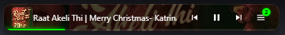

# 🎵 Win11 Music Taskbar Controller

A premium, glassmorphism-inspired music controller for the Windows 11 taskbar. Seamlessly integrate your browser-based music (YouTube, YouTube Music, Spotify) directly into your workspace with a beautiful, real-time interface.



## ✨ Features

### 💎 Premium Glassmorphism UI
Designed with Windows 11 aesthetics in mind, the controller features a sleek dark-acrylic background with real-time backdrop blur. It sits perfectly on your taskbar without obstructing your work.

### 🎨 Dynamic Theming
The app automatically extracts the dominant color from the current track's album art. The **Progress Bar**, **Source Icons**, and **Glow Effects** shift dynamically to match the mood of your music.

### 📊 Audio Wave Visualizer & Progress Styles
Experience your music visually with high-fidelity feedback. Choose your favorite look from the extension settings:
*   **Modern Wave**: A premium, fluid waveform that pulses and flows across the taskbar.
*   **Neon Spectrum**: A vibrant, blurred gradient pulse that melts between Pink, Purple, and Green.
*   **Classic Line**: A minimalist, high-contrast neon green line for a clean look.

### 🖱️ Interactive Control & Seeking
*   **Instant Seeking**: Click anywhere on the progress bar to jump to that part of the song. Features a "White Glow" seek-lock to ensure smooth synchronization.
*   **Shuffle Support**: Dedicated shuffle toggle for Spotify and YouTube Music.
*   **Playback Sync**: High-speed command polling ensures controls react in under 500ms.

### 📜 Seamless Marquee Title
Long song titles are handled with a professional, infinite-loop marquee. The text scrolls smoothly from right to left with a premium fade-out effect, ensuring you can always read the full track name.

### 📑 Multi-Session Management
*   **Peek Mode**: Use your mouse wheel to "peek" through all open music tabs without switching playback.
*   **Session Switcher**: A dedicated sliding panel shows all active browser tabs with thumbnails, artists, and playback status.
*   **Double-Click Focus**: Instantly focus and bring the music-playing browser tab to the front with a double-click on the track info.

### 📍 Precise Positioning & Locking
*   **Position Lock**: Once you've placed the controller on your taskbar, "Lock" it to disable dragging and prevent accidental movement.
*   **X/Y Coordinates**: Set exact pixel positions for a perfect, consistent alignment every time you launch.

### ⚙️ Customizable Settings
Control the experience via the Chrome Extension popup. Toggle features on/off instantly:
- **Progress Style**: Switch between Classic, Modern Wave, and Neon Spectrum.
- **Window Locking**: Freeze the widget in place.
- **Dynamic Theming & Visualizer**
- **Scrolling Title**

## 🚀 Installation

1.  **Clone the Repository**:
    ```bash
    git clone https://github.com/AlimamHu/music-taskbar.git
    cd music-taskbar
    ```
2.  **Install Dependencies**:
    ```bash
    npm install
    ```
3.  **Install Chrome Extension**:
    -   Open Chrome and go to `chrome://extensions/`.
    -   Enable **Developer mode**.
    -   Click **Load unpacked** and select the `extension` folder in the project directory.
4.  **Run the App**:
    ```bash
    npm start
    ```

## 🛠️ Tech Stack
- **Electron**: Frameless, always-on-top window management.
- **Chrome Extension (MV3)**: Metadata extraction and IPC communication.
- **Vanilla JS & CSS**: High-performance UI rendering and animations.

## 🚀 How to Launch

### 1. Developer Mode (Recommended for testing)
Open your terminal and run:
```bash
npm start
```

### 2. Quick Launch (One-Click)
I've created a **`launch.bat`** file in the project folder. You can simply **double-click** it to start the controller without opening a terminal.

### 3. Build a Standalone App (.exe)
If you want to use it as a permanent app on your computer, you can package it into a single `.exe` file:
1. Run `npm install --save-dev electron-builder`
2. Run `npx electron-builder`
3. Your installer will be in the `dist` folder.

---
*Created with ❤️ by Antigravity*
